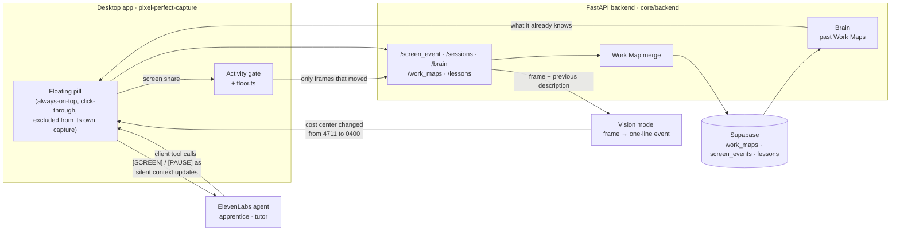

# The AI Apprentice

An apprentice that learns a job by watching an expert do it, then teaches it to the next person.

It sits on the desktop as a floating pill, watches the screen while the expert works, stays quiet
while they type, asks *why* at natural pauses, debriefs the gaps once the task is done, and
explains the whole process back until the expert says "yes, that is how it works." What it learned
becomes a **Work Map** — the steps, the judgment behind each one and the guardrails around them —
which a second agent then uses to coach a new hire through a case the expert never showed them.

Built for the 7th Global AI Hackathon · ElevenLabs × Hack-Nation, Challenge 01.

> An apprentice, not a recorder. A recorder captures what happened. This asks why, learns the rules
> behind each step, and keeps asking until nothing is unclear.

## The problem we actually had to solve

Reading a screen is the easy part — vision models already do that well. The hard part is
**restraint**. Every voice agent ever built is optimised to respond, and this one has to mostly
not. Three sub-problems fall out of that:

| Problem | Why it is hard |
| --- | --- |
| **Perception bandwidth** | You cannot stream video into an agent's context. You need a cheap, lossy, *semantic* compression of a screen over time. |
| **Earned silence** | The agent must stay quiet through typing, reading and talking, then speak at the one right moment — using signals it does not natively have. |
| **Verification** | An LLM summary of a transcript is not knowledge. If a new hire could not do the job from it, you built a recorder. |

## The three modules

| Module | What it does | Where |
| --- | --- | --- |
| **1 · Capture** | The expert shares a screen and works. Screen changes become events; the apprentice asks why at pauses. | `use-screen-events`, `lib/floor.ts`, `screen_vision.py` |
| **2 · Map** | A spoken debrief closes the gaps, then a teach-back the expert confirms. The result is a Work Map. | `work_map_merge.py`, `WorkMap.tsx` |
| **3 · Teach** | A second agent coaches a new hire through their own case, stepping in before a guardrail breaks. | `tutor.py`, `use-tutor`, `Tutor.tsx` |

And across sessions, a **brain**: what the apprentice already learned is carried into the next
session, so it never asks the same question twice (`brain.py`).

## Architecture



### The five decisions that matter

**1. A classical-CV gate in front of an expensive model.** Frames are compared as small thumbnails
before anything is sent anywhere. If the screen has not meaningfully moved, **the frame never
leaves the machine** — no model call at all. Tuned so typing a few characters clears the bar but a
blinking caret or a moving mouse does not. Cost and latency scale with *activity*, not wall-clock
time.

**2. Screen events enter the context as text, not pixels.** What survives the gate goes to a vision
model with the *previous description* as context, forced to strict JSON and prompted to default to
"no change". The result is pushed into the live conversation as a **silent context update** —
`[SCREEN 03:12] cost center changed from 4711 to 0400` — which lands in context *without* asking
the agent to reply. Sight and speech share one text stream; there is no multimodal plumbing
anywhere.

**3. When to speak is decided in the pill, not by the agent.** [`lib/floor.ts`](pixel-perfect-capture/src/lib/floor.ts)
(unit-tested) reads talking, typing, scrolling and reading, and only sends `[PAUSE]` after a real
on-screen action, within a question budget. Replies the agent makes without the floor are **muted**,
and it is told `[NOT HEARD]` so it can re-ask later. Restraint is enforced by the pipeline, not by
asking the model nicely.

**4. Capture is structural, not hoped-for.** The agent's tools are the only way the session moves:
it cannot reach the debrief without `start_debrief`, cannot reach the teach-back without
`start_teach_back`, and cannot finish without `confirm_work_map` — which only fires once the expert
has heard the whole process read back and agreed. Corrections are recorded as first-class data.

**5. The merge is not trusted with what makes the map believable.** An LLM merges screen events,
transcript and live captures into steps and guardrails — but a quote is dropped unless it appears
verbatim in what the expert actually said, and every time is snapped onto a real screen event. See
[`work_map_merge.py`](core/backend/src/services/work_map_merge.py).

One rule holds the UI honest: an answer shows as captured **only** after the agent calls a recording
tool, never on a timer.

## Repo layout

```
core/backend/                        FastAPI backend
  src/services/
    apprentice_agent.py              both ElevenLabs agents: prompts, voice, tools
    screen_vision.py                 frames → events (OpenAI, or local FastVLM)
    work_map_merge.py                session → Work Map, with grounded quotes
    tutor.py                         judges a new hire's step against the Work Map
    brain.py                         what the apprentice knows from past sessions
  storage/                           Work Maps, screen moments, lessons (Postgres)
  scripts/rehearse_agent.py          replay a scripted session over text
  scripts/rehearse_tutor.py          replay a lesson over text

pixel-perfect-capture/               Electron + TanStack Start desktop app
  electron/main.cjs                  app window + floating pill, capture permissions
  src/lib/floor.ts                   when the apprentice is allowed to speak (tested)
  src/hooks/use-apprentice.ts        the apprentice conversation and its client tools
  src/hooks/use-tutor.ts             the tutor conversation and lesson checks
  src/components/WorkMap.tsx         Work Map as a graph (React Flow)
```

## Setup

Requires **Python 3.12+**, [uv](https://docs.astral.sh/uv/), **Bun**, a **Supabase** project, and
**ElevenLabs** and **OpenAI** keys.

### 1. Database

Run the migrations in [`core/backend/storage/migrations/`](core/backend/storage/migrations/) in the
Supabase SQL editor, in order (`001` → `003`). RLS is on with no policies on purpose: only the
backend touches these tables, over its own connection.

### 2. Backend

```sh
cd core/backend
uv sync
```

Create `core/backend/.env.development`:

```sh
ELEVENLABS_API_KEY=...     # the apprentice and tutor agents, and their voice
ELEVENLABS_VOICE_ID=...    # optional
OPENAI_API_KEY=...         # screen understanding, Work Map merge, tutor checks
SUPABASE_DB_URL=postgresql://...   # Postgres connection string
```

Optional: `VISION_PROVIDER` (`openai` default, `fastvlm` stubbed), `VISION_MODEL`, `MERGE_MODEL`,
`APPRENTICE_LLM`, `SCREEN_DEBUG=true` to dump the frames the vision model looked at.

Create the two agents in your ElevenLabs workspace, then start the server:

```sh
uv run python -m src.services.apprentice_agent   # creates/updates both agents
uv run main.py                                   # http://localhost:8000 — check /health
```

The agents are defined entirely in `apprentice_agent.py`. **Never edit them in the ElevenLabs
dashboard** — the next sync overwrites it.

### 3. Desktop app

```sh
cd pixel-perfect-capture
bun install
bun run desktop     # Vite on :8080 + the Electron shell
```

Point it elsewhere with `VITE_BACKEND_URL`. `bun run dev` runs the pill in a browser tab instead,
without the floating window.

On first run macOS asks for **microphone** and **screen recording**. Screen recording only appears
in System Settings → Privacy & Security after the app has asked once; grant it and restart.

### 4. Run a session

Hit **Start session**, share the screen you actually work in, and do a real task out loud.
Keyboard: `S` start/end · `R` pause · `O` off the record · `L` park a question · `→` skip a debrief
question · `Esc` end. Work Maps are at **/work-maps**; open one and start a lesson to run the tutor.

## What worked, and what didn't

**Worked**

- Events-as-text. The agent reasons about screen content with no multimodal plumbing at all.
- Moving the floor into the pill. Deciding when the agent *may* speak in client code, and muting it
  when it speaks anyway, fixed the interruptions that prompt rules alone never did.
- Grounding the merge. Dropping any quote the expert did not actually say is what makes a Work Map
  worth trusting.
- The pill as a desktop object: content-protected, non-activating, click-through.

**Didn't**

- **Local vision.** A FastVLM backend is wired in behind `VISION_PROVIDER` so frames could stay on
  the machine, but inference was never finished and it raises `NotImplementedError`. Frames go to
  OpenAI. What shipped instead is **off the record** (`O`), which cuts the microphone *and* screen
  sampling in one keystroke.
- **Config is still from the product this was forked out of.** `config.py` carries settings for TTS
  providers, vector stores and video pipelines that no longer exist. We pruned the boot checks to
  what is actually used; the rest is dead weight we would delete next.
- **One expert, one task at a time.** The brain matches tasks by word overlap, which is right at
  this size and wrong at a thousand Work Maps — that is where embeddings start earning their keep.

## Where it goes next

Today the apprentice remembers across sessions, so it asks only about what is new. The version worth
building is the **always-on apprentice**: no scheduled sessions at all, just an apprentice that
notices a case it has never seen during ordinary work and asks one question at the right moment.
Everything needed is already here — the activity gate makes continuous watching affordable, the
floor already knows when not to speak, and the brain already knows what is new.

## Stack

ElevenLabs Agents (apprentice + tutor) · Scribe realtime ASR · OpenAI GPT-4.1 (vision, merge, tutor
checks) · FastAPI · Supabase Postgres · Electron · TanStack Start · React Flow · Tailwind
